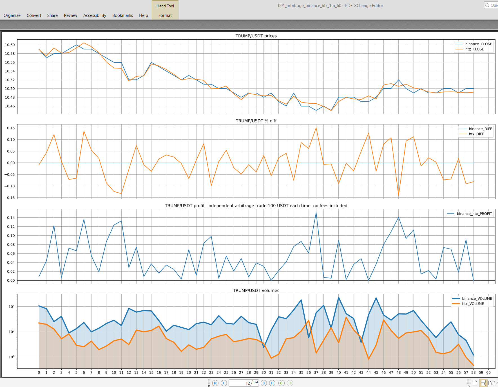
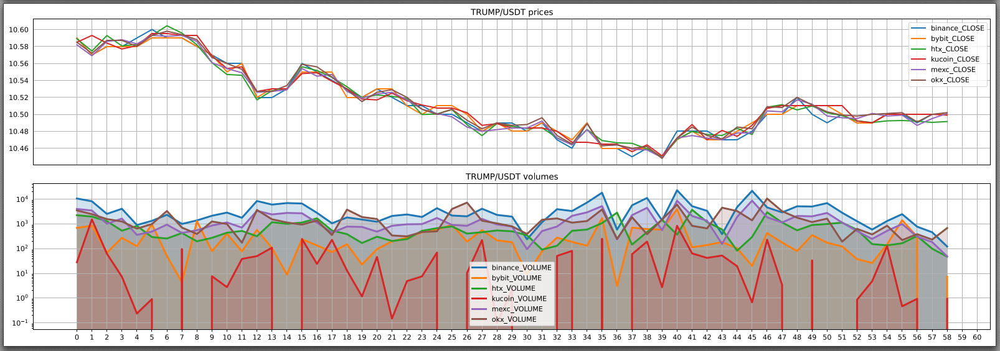

# Crypto trading research

arbitrage_stock_to_stock.py
===========================

Calculate the best stock exchange pairs to use for arbitrage.

- Get all pairs that available on provided list of stock exchanges with USDT coin
- Collect ohlcv from provided list of stock exchanges. Collect data based on `timeframe` and `limit` (number of ohlcv) since the current date. 
  Simultaneously from different stocks which are served in separate processes

Calculate and plot for all pairs. Plots are organized by stock exchange pair - ranked from best to use to the worse.

Ranking: 
- For each stock exchange pair:
  - For each trading pair calculate profit from arbitrage based on 100 USDT trade each time (each timeframe). 
    Fees are not included. Volume is taken into account
  - Sort trading pairs by sum of non zero profit dates (SNZP)
- Sort stock exchange pairs by sum(list of SNZP for each trading pair) / len(pairs)

Each plot contains:

- Prices from two stocks
- Prices difference in % (stock A - stock B)
- Profit from arbitrage based on 100 USDT trade each time. Fees are not included. Volume is taken into account
- Volumes from two stocks

arbitrage_triangular.py
=======================

Triangulate arbitrage between trading pairs on the same stock. 

For example BTC/USDT - ETH/BTC - ETH/USDT

Still in dev ...

test_stat_rand_walk.ipynb
=========================

Some shit

prerequisites
=============

Python 3.12.6

`python.exe -m pip list install -r requirements.txt`

tested on Windows 11